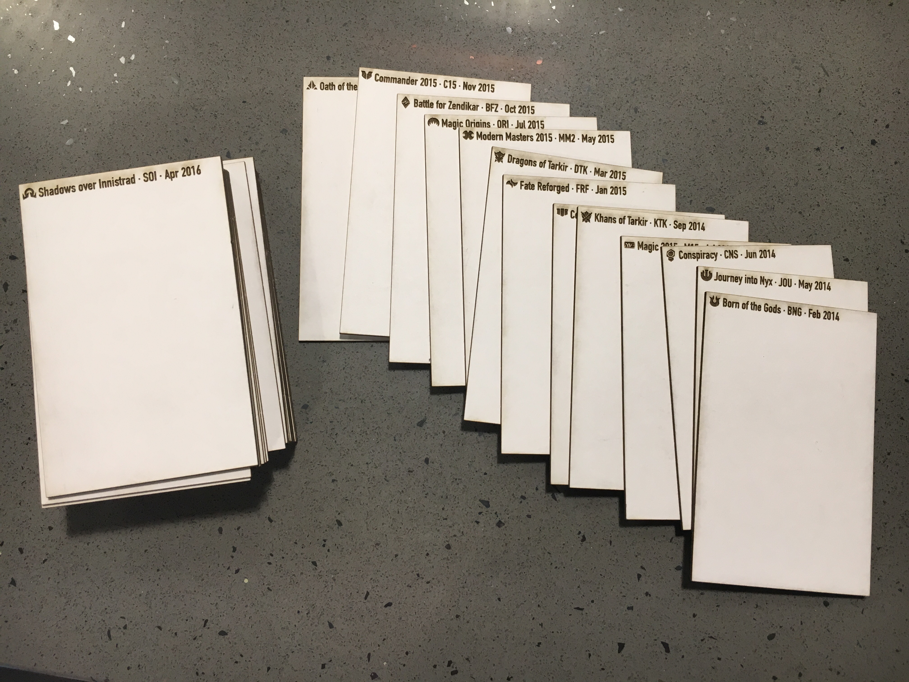
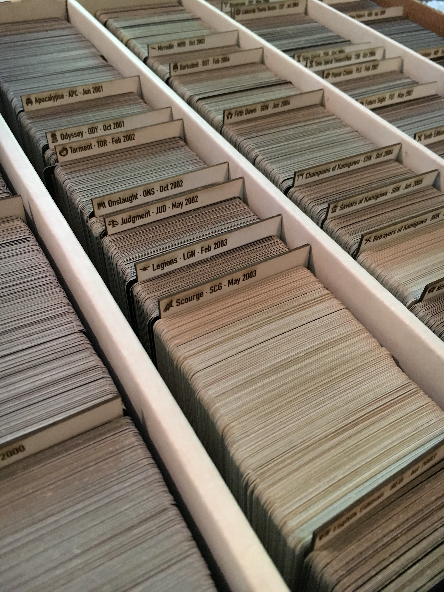

# magic-card-dividers

This repository contains a Ruby script to generate SVG files that can be laser cut to form card dividers for your Magic: the Gathering collection.

The Ruby script consumes the [Scryfall](https://scryfall.com/) API to get information about Magic: the Gathering sets. `sets.json` is bundled with this repository, but you may want to [download an updated version](https://api.scryfall.com/sets) of it before running the Ruby script to ensure you have access to all newly released sets.

For each set, the Ruby script further loads set icons and release dates from Scryfall before laying out card dividers eight at a time into an SVG file. SVG files will be saved to a newly created `/svg` directory.

The SVG files are laid out to fit eight card dividers onto a 10" x 8" piece of material (I used mat board). After generating SVG files, load them onto your laser cutter of choice and go crazy.

## End Results

## Running make-svgs-from-sets.rb

Dependencies are included in the project's Gemfile. Install `bundler` if you don't have it.

    $ gem install bundler

Use `bundler` to install dependencies ([`httparty`](https://github.com/jnunemaker/httparty) and [`tty-prompt`](https://github.com/piotrmurach/tty-prompt))

    $ bundle install

Run without arguments. The script will start with the most recent set in `sets.json`.

    $ ruby make-svgs-from-sets.rb

View help message.

    $ ruby make-svgs-from-sets.rb -h

Run with a set to start from. Instead of starting at the most recent set, the script will start at the specified set.

    $ ruby make-svgs-from-sets.rb -s 'Scars of Mirrodin'

The script skips sets like Token sets, Duel Decks, and various other types of sets by default. Edit the `is_skippable?` method if you would like dividers for those sets.

## Tips about SVG output

Raster lines are created with width 0.1 pt. You might need to tweak this if your laser cutter requires a different width.

Set icons loaded from Scryfall are scaled before being laid out on the SVG files. The transformation is very simple. You may want to audit its results and tweak the set icons in the generated files as appropriate. For example, certain set icons may end up larger than others. Set icons that are very wide may need to be re-centered vertically.

The font I chose for SVG text tags may not be available on your system.

## Copyright

Magic: the Gathering is copyrighted by Wizards of the Coast, LLC, a subsidiary of Hasbro, Inc. This project is unofficial Fan Content.

Scryfall is copyrighted by Scryfall, LLC.
